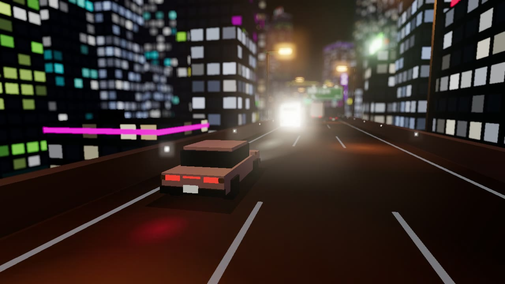
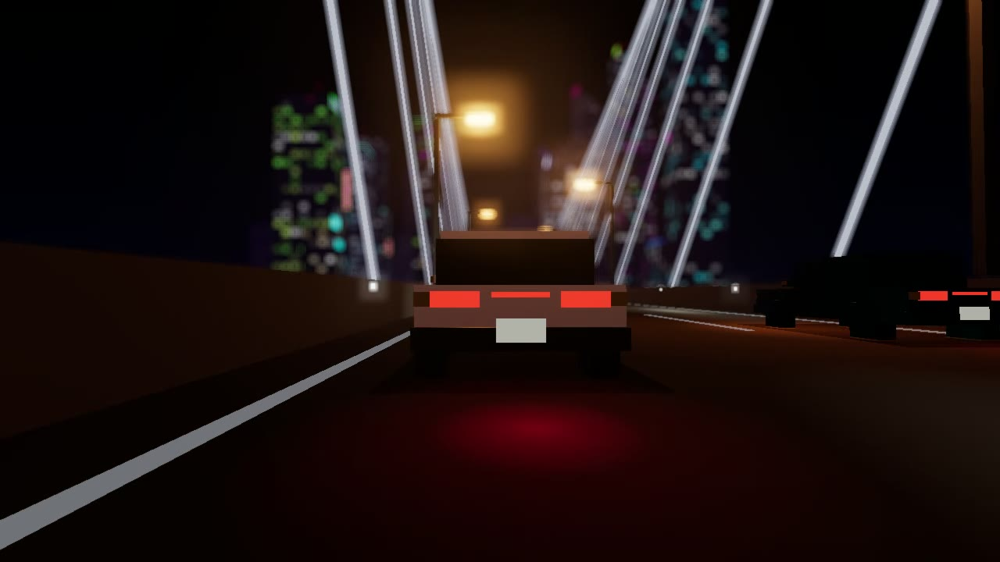
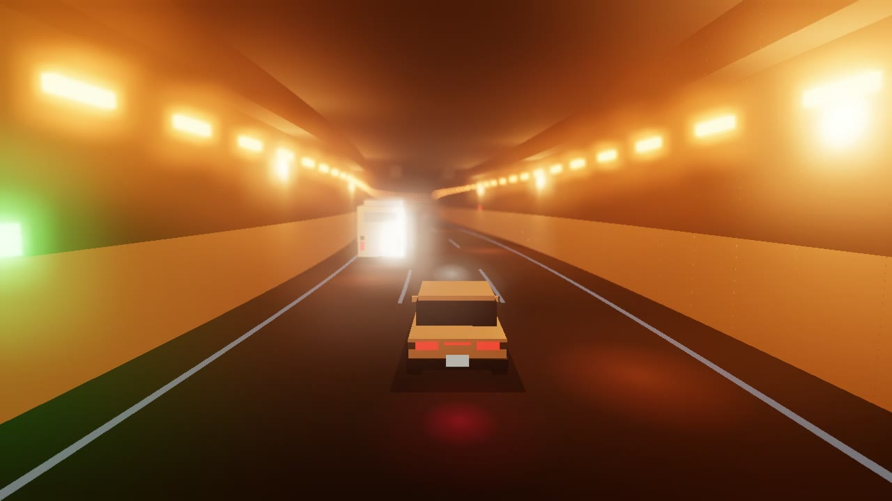

# 首都高ボクセルナイト



**▶ ブラウザで見る: https://kasei-san.github.io/shutoko-voxel-night/**
**▶ PV（約1分）: https://kasei-san.github.io/shutoko-voxel-night/?pv**

ボクセルアートで夜の首都高を延々と走る Three.js 作品です。
ネオンのビル群、オレンジの道路照明、ベイブリッジ風の斜張橋、ナトリウム灯のトンネルを、被写界深度のボケと発光で幻想的に描きます。
音楽と効果音もすべてブラウザ内で合成しています（音源ファイルなし）。

| 街 | 橋 | トンネル |
|---|---|---|
|  |  |  |

## 見どころ

- **道路** — 3車線・一方通行の高架。ランダムに左右へカーブする
- **自分の車（白いセダン）** — ときどきウインカーを出して車線変更する。隣の車線が空いているときだけ動く
- **周りの車** — セダン・トラック・高速バスが、抜いたり抜かれたりする。ブレーキランプやウインカーも点く
- **ビル** — 大きさはランダムで、窓は白から蛍光色に光る。屋上・壁面・端っこにネオン看板がある
- **照明と標識** — オレンジの道路照明が等間隔に続く。緑の案内標識がときどき出てくる
- **橋とトンネル** — 街の合間にランダムで現れる
  - 橋はベイブリッジ風。H 型の主塔、斜張ケーブル、海面への映り込みがある
  - トンネルはナトリウム灯で、中に入ると車も壁もオレンジに染まる
- **カメラ** — 後方・正面・斜め・斜め上空・真上・ローアングルを 20〜30 秒ごとに切り替える
- **サウンド**
  - チル系のローファイ BGM（エレピ・パッド・ベース・ドラム・レコードノイズ）
  - 車が横を通り過ぎる音と、ウインカーのカチコチ音

## 操作

| 操作 | 内容 |
|---|---|
| クリック | 音を鳴らす（ブラウザの自動再生制限のため） |
| `G` | 設定パネルの表示切替（ボケ・発光・露出・霧・交通量・音量など） |
| `C` | 次のカメラアングルへ |
| `M` | ミュート |

## URL パラメータ

| パラメータ | 内容 |
|---|---|
| `?pv` | PV モード。街 → 橋 → 街 → トンネル → 街 を約1分で流す。クリックで開始 |
| `?start=bridge` / `?start=tunnel` | 開始直後に橋／トンネルを出す（確認用） |
| `?pv&rec` | PV を 1280×720 で録画する。ローカルの保存用サーバーが必要（下記） |

## ローカルで動かす

`index.html` 1ファイルだけで動きます。Three.js は CDN から読み込むので、ネット接続が必要です。

```sh
python -m http.server 8765
# http://localhost:8765/ を開く
```

## PV を動画にする

`?pv&rec` を付けて開くと、PV を自動で再生しながら映像と音を録画します。
録画が終わると `tools/rec_server.py` に送って `out/pv_raw.webm` に保存します。

```sh
# 1. 保存用サーバー（動画を受け取ると終了する）
python tools/rec_server.py 8766

# 2. 録画用の Chrome を別プロファイルで起動する
#    ウィンドウが他のウィンドウに隠れても描画が止まらないように、フラグを付ける
chrome --user-data-dir=tmp_chrome_profile --no-first-run \
  --autoplay-policy=no-user-gesture-required \
  --disable-backgrounding-occluded-windows --disable-renderer-backgrounding \
  --disable-background-timer-throttling \
  --app="http://localhost:8766/index.html?pv&rec"

# 3. スマホ向けの mp4（H.264 / AAC）に変換する
ffmpeg -i out/pv_raw.webm -vf "fps=30,format=yuv420p" -c:v libx264 -preset slow -crf 24 \
  -profile:v high -level 4.0 -c:a aac -b:a 128k -ar 48000 -movflags +faststart out/shutoko_pv.mp4
```

1分ほどの PV で 15MB 前後になります。

## 技術メモ

- Three.js r160（CDN）、ビルド不要の単一 HTML
- 道路は 1m 刻みの中心線を生成し、50m ごとのチャンク単位で組み立てて捨てる
  - 同じマテリアルのジオメトリはチャンクごとに結合して、描画回数を抑えている
- ポストプロセスは RenderPass → BokehPass → UnrealBloomPass → OutputPass
- 光のにじみ（ハロー・路面の照り返し）は別レイヤーに置き、被写界深度の深度バッファには入れない
- トンネル内は環境光と霧の色をオレンジに寄せて、ナトリウム灯の単色っぽさを出している
- 音は Web Audio API のオシレーターとノイズで合成し、先読みスケジューラで鳴らしている
